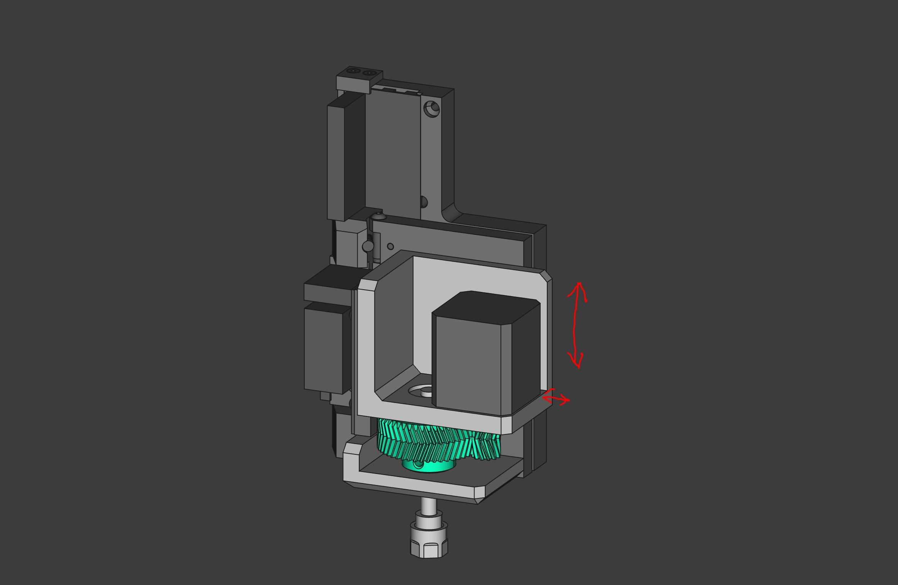
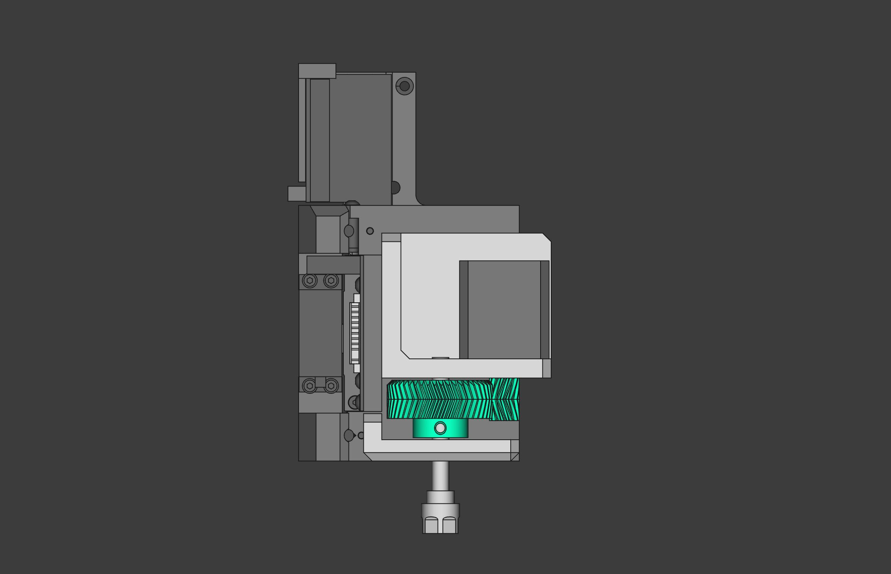
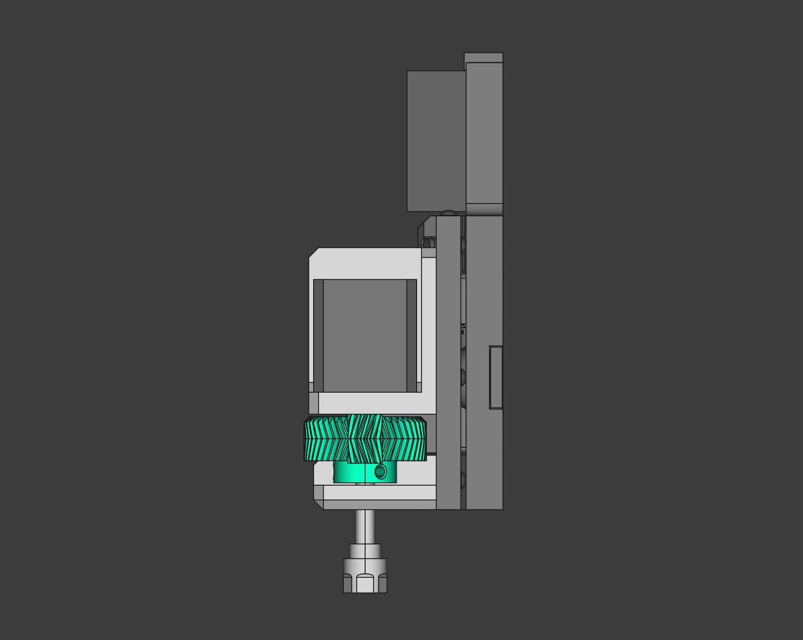

# Hotplate fabricatable 4th-axis
*by Jens Dyvik, april 2022*
**Status: early design phase**

### What

- A simple 4th axis with 4:1 ratio
- Designed for use on the [Clank](https://clank.tools/) motion system by Jake Read
- Uses readymade "ER11 extension" for tool clamping and as a shaft

### BOM

 - 1pcs - ER11 extension
 - 2pcs - 608 beraings
 - xacto knife blades
 - 3mm screws
 - 1pcs - Nema17 stepper motor

### How

 - 3D print parts and assemble

### Screnshots of CAD sketch

